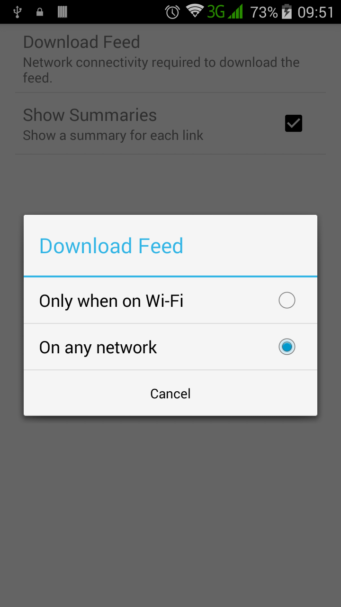
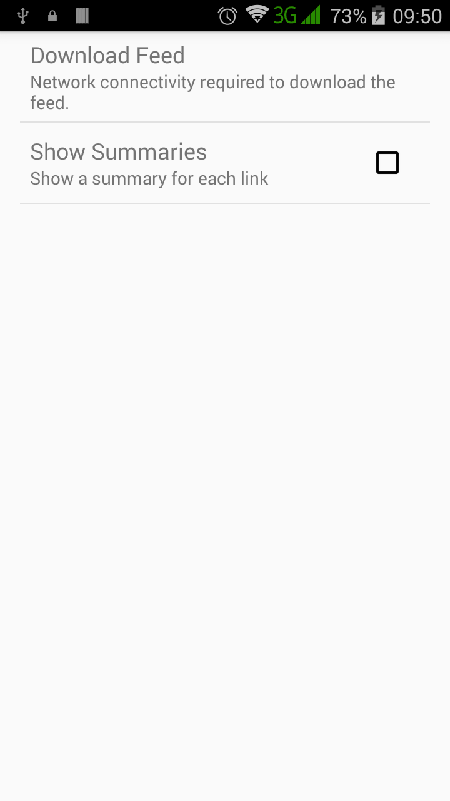

# XML Test

An e*X*ample of how to *M*ake a *List* of items from XML in Android. 

## Introduction :point_up:

This repo contains an implementation of a [tutorial on Android XML] (https://developer.android.com/training/basics/network-ops/xml.html). The webpage in which this tutorial is found has the title "Parsing XML Data". 

The app fetches recent Android-related [StackOverflow] (http://stackoverflow.com/) posts. One can decide to do fetching over only Wi-Fi or over any network.

## Version History :package:

**latest** 	XML Test v1.0.0 	Thursday, May 26, 2016		[download](download link) 

This repo tries its best to follow the [Semantic Versioning](http://semver.org/) guidelines.

## How To Use :wrench:

These are the steps of use:

1. Fire up the app.
	
	You should see a screen showing the feeds. Screen looks like this:

	

2. Select the "More" button to refresh the page or access settings.

	Here is how selecting "More" looks like:

	

3. In the settings, change your preferences.

	The default settings look similar to:

	

	Choosing to change download feed will lead you to these options:

	

	As an example, if you choose to load feeds off Wi-Fi alone and then turn off Wi-Fi, the feeds screen will appear like:

	

	In the settings, you can also choose not to show a summary for each link by unchecking the summary tick box. Screenshot 6 shows this:

	

	Feeds without summaries appear as seen in Screenshot 7.

	
	
## Abilities :muscle:

This app can:
* Fetch Android-related posts from StackOverflow in XML.
* Display fetched feeds in human-readable form.

## Limitations :worried:

This is just a tutorial. :grin: It cannot:
* Provide a lot of feed details.

## Possible Future Work :fast_forward:

I think the tutorial did what is was supposed to do, no? :smile:

## Other things :books:

This tutorial was done to understand both Android XML parsing and Android settings. I can safely say both have been understood at least basically. :smile:

## License :lock_with_ink_pen:

This repository is licensed under the [GNU General Public License Version 3](http://www.gnu.org/licenses/gpl-3.0.en.html).
